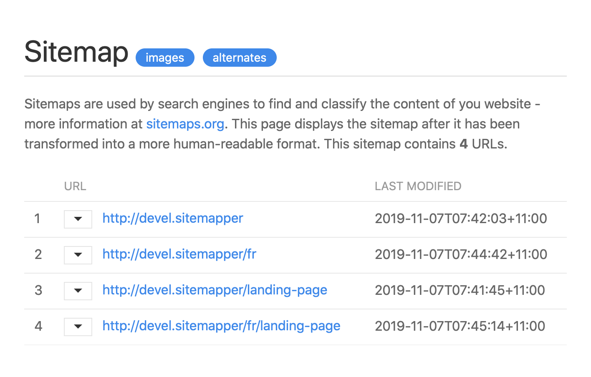

# Cre8iv Sitemapper: auto-generated sitemaps for Kirby 3

The Cre8iv Sitemapper is a plugin we created at [Cre8iv Click](https://cre8iv.click), to auto-generate syntactically-correct xml sitemaps for our clients' Kirby websites. Sitemaps are used by search engines to find and catalogue the content of your site - and hopefully help your site rankings!



Here is what you need to know about Sitemapper:

* It makes the sitemap automatically available at _https://yoursite.com/sitemap.xml_. It will also try to guess when a visitor/bot enters a wrong url - such as _http://yoursite.com/en/sitemap.xml_ - and will automatically redirect them to the correct address.
* If uses a nice stylesheet to display the site in a human-readable format, if accessed on a browser.
* It allows you to carefully control which pages get added to - and excluded from - the sitemap. You can control it via a blueprint option, or via a field on the page itself.
* It allows you to control which images get added to the sitemap, and to which pages. You can control it via bluprint options, and via a field on the individual image content page.
* It maps pages correctly on multilingual sites, whether the page is multilingual or single-language.

****

## Installation

### Manual Download
You can simply download and copy this repository to `/site/plugins/sitemapper`.

### Git Submodule
You can add Sitemapper to your project as a git submodule, with this command:

```
git submodule add https://gitlab.com/cre8ivclick/sitemapper.git site/plugins/sitemapper
```

### Composer
If you use composer, you can quickly add Sitemapper to your project like this:
```
composer require cre8ivclick/sitemapper
```

****

## Usage
Sitemapper automatically generates a sitemap of all _published_ pages in your website. It includes all pages, and their images, leaving out the site's Error page. So, right after installing it, you can go to _https://yoursite.com/sitemap.xml_, and you should already see all your pages - and their images - listed there. Unfortunately, that's usually not what you want: you will almost always need to customise how Sitemapper lists your pages, and groups your images.

### `sitemap` option in page blueprints
The first way to customise how a pages gets included in your sitemap, is to add a `sitemap` option to its blueprint. In your 'blueprint.yml' file, add a `sitemap` option like this:

```
options:
  delete: false
  changeTemplate: false
  # add a 'sitemap' option with the appropriate value, if needed
  sitemap: hide
```

When Sitemapper doesn't find a `sitemap` option in the blueprint, it assumes that the page _should_ be added to the sitemap, as normal. In multilingual sites, it will add the URLs for the page in every language available on the site. That means that you really only need to add a `sitemap` option to your blueprint if you want to hide the page, or limit how Sitemapper lists it.

The `sitemap` option can be one of 3 values:

* `sitemap: hide` means the page, its images and all its children (and their images) will be skipped and excluded from the sitemap.
* `sitemap: images` is meant to be used for [One-Pagers](https://getkirby.com/docs/reference/panel/samples/one-pager): in this scenario, you want the parent page listed, but not the children - because they are not really separate 'pages': they are just sections within the parent page. By setting the `sitemap` option to `images` in the children pages, we tell Sitemapper that we don't want these pages listed, but that we do want their images listed _under their parent_. See example below.
* `sitemap: lang` is for single-language pages in multilingual sites. Here, `lang` is a language code - such as 'en', 'fr' or 'de' - which tells Sitemapper which language the page is supposed to be listed under. This is needed, when you have separate blueprints for different languages in a multilingual setup - see example below.

Again, remember that you don't have to add a `sitemap` option to every blueprint. If there is no `sitemap` option, Sitemapper automatically assumes this is a 'normal' page, and that it _should_ be included in the sitemap - as well as its children, and its images.

### `sitemap` field for Pages and Files
Sometimes, there may be specific pages or images that you may want to exclude from the sitemap. In this case, add a `sitemap` field to the page/image blueprint, to let Sitemapper know whether the page or image file should be included in the sitemap or not. The field **must** be named "sitemap", and it should return a boolean value - Kirby's toggle or checkbox fields are good candidates for this.

To make your job easier, Sitemapper already comes with a simple, suitable 'sitemap' field blueprint, which you can include or extend in your own page or file blueprints, like this:

```
# to use the field 'as-is':
sitemap: fields/sitemap
```

```
# to extend it:
sitemap:
  extends: fields/sitemap
  help: help: Adding content to your site's sitemap helps your search engine rankings.
```

If the field is 'on' or 'checked', the page/file will be included. If it is 'off' or 'unchecked', it will be excluded from the sitemap.

### Advanced: additional filter function
If you are still seeing pages in your sitemap that shouldn't be there, you can define an additional filter function, which will be used to filter out unwanted pages. Note that this function is used _in addition to_ the usual filtering that Sitemapper does - so you can use it in conjunction with the 'sitemap' blueprint and field options described above.

You can define an additional filtering function in your site's `config.php` file, like this:

```
'cre8ivclick.sitemapper.pageFilter' => function($p){
    // filtering code goes here:
    if($p->secret()->exists()) {
      return false;
    } else {
      return true;
    }
}
```

The function should take a single argument - the page - and return either 'true' or 'false'. When it returns 'true', the page is included in the sitemap. If it returns 'false', the page is excluded.

****

## Examples

### One-Pager
Let's say that we have a site, where the Home page is a "one-pager". That means, that the Home page has children pages (sub-pages), where each represents a 'section' of the page layout - like 'Hero Banner', 'About Us' and 'Our Services'. This is a common programming pattern, but can be problematic for a sitemap.

The problem is, that we don't want the children pages listed in the map. They are not 'pages', after all - they are just 'sections' of the Home page. On the other hand, these sections have _images_, that we do want to be included in the sitemap - but they should be listed as if they were images of the Home page (the parent page).

We can set this up quickly using the `sitemap` blueprint options in our pages, like this:

* **Home page** does not need a `sitemap` option at all - it will be listed normally.
* **child pages** should have `sitemap: images` in their blueprint options.

The `sitemap: images` option will tell Sitemapper that we don't want the child page listed, but we want its images added to the parent page.

### Multilingual Site
When we turn on multilingual features in our Kirby sites, Kirby assumes that all the content from _every page_ is going to be multilingual. But that is almost never the case: usually, multilingual sites will indeed have content that should be translated into all languages - like the Home page - but also content that may be specific to a single language - like a blog article or a landing page, which should only be shown to visitors browsing the site in a specific language.

A common way programmers deal with this is by creating multiple templates for content that can be 'single-language only'. For example, let's say that we have a bilingual site with content in both English and German. The site has a blog, but in our blog not _every_ article will be bilingual. Some articles will be available only English, some only in German, and some will be in both languages. In this scenario, the programmer will often create 3 separate blueprints: 'article-en', 'article-de' and 'article-multi'. The programmer can then use a plugin such as [Panel View Extended](https://github.com/mullema/k3-panel-view-extended) to disable and hide the multilingual features on these single-language pages.

The problem with this kind of setup is that when you store content for a single-language page in a multilingual site, internally Kirby always stores the content under the _default language_. So, if the default language in our site is English, when the user saves their German 'article-de' page, the content will be saved in an 'English' content file (even though we are presenting it to the user as German). This means, that for these single-language pages, we cannot rely on Kirby's functions to tell us what language the page is actually using - so we use the `sitemap` blueprint option to do it.

In a multilingual site, if the blueprint has no `sitemap` option, then Sitemapper will include the page's URLs in all the languages. If we want to treat the page as a single-language page, and include its URL in just the appropriate language, we pass the language to the `sitemap` option. In our example it works like this:

* The parent **'Blog' page** itself is a normal multilingual page, so we don't need to add a `sitemap` option at all - and we'll get 2 Blog page URLs listed: one for the English version, one for the German.
* **'article-multi' pages** are also normal, multilingual pages, so no bluprint option is needed, and the page URLs for both languages will appear in the sitemap.
* **'article-en' pages** are single-language, so their blueprint should have `sitemap: en` - this will ensure that only the English URL is listed in the map.
* **'article-de' pages** are also single-language, so they should have `sitemap: de` - and only the German URL will appear in the map.

### Complete Example
Let's say we have a bilingual site - English and German - with a Home page that is setup as a 'one-pager'. The site also has a Blog, with articles that can be in both languages, and articles that should appear only in English or in German. The site was also setup with a 'Global' page, which includes the sections that are used across multiple pages in the website - like 'Footer' and 'Contact'.

We could quickly configure our sitemap like this:

```
Page                  `sitemap` blueprint setting
-------------------------------------------------------
Home                    nothing (normal)
  |- Hero Banner        sitemap: images
  |- About Us           sitemap: images
  |- Our Services       sitemap: images
Blog                    nothing (normal)
  |- article-multi      nothing (normal)
  |- article-en         sitemap: en
  |- article-de         sitemap: de
Global                  sitemap: hide
  |- Contact            nothing (automatically hidden)
  |- Footer             nothing (automatically hidden)
Error                   nothing (automatically hidden)
```

****

## Contributing
Please use the 'Issues' page of this project to report any bugs you find, and post ideas and feature requests.

We have tried to keep the code in the plugin reasonably simple, organised and well-commented. Feel free to fork this project, and send enhancements and bug fixes via merge requests. Please be aware, that we aim to keep the plugin _simple_ and _easy to maintain_.

## To-Do
* list a site's video content
* add config options to allow some customisation of sitemap styling

## License

Sitemapper is released under the MIT License - see the 'LICENSE.md' file included in this repository for full license text.

## Credits

The Cre8iv Sitemapper is developed by [Cre8iv Click](https://cre8iv.click), but we stand on the shoulder of giants:

* the code started by extending [this Cookbook recipe](https://getkirby.com/docs/cookbook/content/sitemap) in the excellent Kirby Docs
* the stylesheet is based on work done by [Alan Wu](https://github.com/catcto/sitemap-stylesheet)
* some of the logic was based on previous sitemap work done by [David Somers](https://github.com/omz13/kirby3-xmlsitemap)

Styling of the sitemap is done using the amazing [UIKit](https://getuikit.com) frontend framework.

